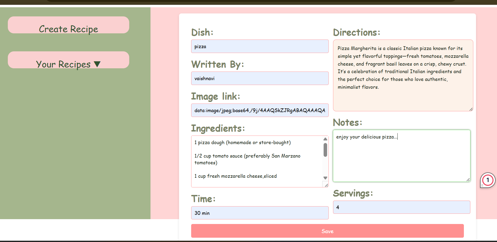
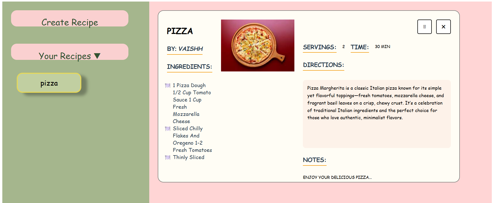

# 🥗 Recipe Writer

A clean and user-friendly React app that lets users **write, view, and explore recipes** with detailed ingredients and cooking instructions. Perfect for food lovers who want to create or find the perfect dish.

> 🔗 [Live Demo on Netlify](https://recipewriter.netlify.app/) 

## 📸 Screenshot




## ✨ Features

- Add,Delete,Close and View detailed recipes
- Ingredients and step-by-step instructions
- Responsive design for mobile and desktop
- Fast, modern UI with React and Tailwind

---

## 🛠️ Tech Stack

- ⚛️ React
- ⚡ Vite
- 🎨 Tailwind CSS

---

## 🚀 Getting Started

1. Clone the repository:
   ```bash
   git clone https://github.com/yourusername/recipe-writer.git
   cd recipe-writer
